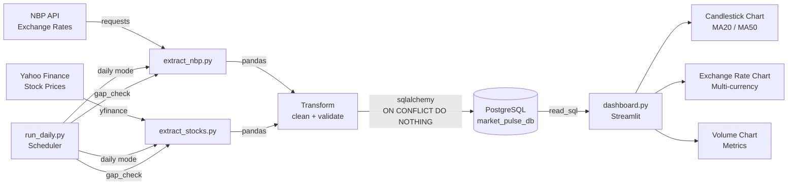

# Market Pulse

Financial data pipeline with PostgreSQL and interactive Streamlit dashboard.
Tracks exchange rates and stock prices with automatic daily updates.

## Architecture



## Stack

| Layer | Technology |
|---|---|
| Extract | `requests` (NBP API), `yfinance` (stocks) |
| Transform | `pandas` |
| Load | `sqlalchemy` + `psycopg2` → PostgreSQL |
| Orchestration | `run_daily.py` + Windows Task Scheduler |
| Dashboard | `Streamlit` + `Plotly` |

## Features

- Daily exchange rates: EUR, USD, GBP, CHF from NBP API
- Stock prices: CDR.WA, PKN.WA, PKO.WA (GPW) + SPY, QQQ, AAPL, NVDA (NYSE)
- Smart loading: pulls only missing data based on last date in DB
- Gap detection: finds and fills missing trading days
- Holiday-aware: skips Polish and US public holidays automatically
- Duplicate-safe: `ON CONFLICT DO NOTHING` prevents double loading
- Interactive dashboard: candlestick charts, MA20/MA50, volume, metrics
- Query cache: `st.cache_data` with 1h TTL

## Project Structure

```
market-pulse/
├── src/
│   ├── db.py               # database connection
│   ├── extract_nbp.py      # NBP API pipeline (initial/daily/gap_check)
│   ├── extract_stocks.py   # yfinance pipeline (initial/daily/gap_check)
│   └── dashboard.py        # Streamlit dashboard
├── logs/                   # daily run logs
├── config.py               # instruments config
├── run_daily.py            # daily scheduler script
├── requirements.txt
└── .env                    # credentials (not in repo)
```

## Setup

**1. Clone and install:**
```bash
git clone https://github.com/rzzepa/market-pulse.git
cd market-pulse
python -m venv .venv
.venv\Scripts\activate
pip install -r requirements.txt
```

**2. Create `.env` file:**
```
DB_HOST=localhost
DB_PORT=5432
DB_NAME=market_pulse_db
DB_USER=postgres
DB_PASSWORD=your_password
```

**3. Create database and run DDL:**

Create `market_pulse_db` in PostgreSQL, then run `schema.sql`.

**4. Load historical data:**
```bash
python src/extract_nbp.py --mode initial --from 2020-01-01
python src/extract_stocks.py --mode initial --from 2020-01-01
```

**5. Launch dashboard:**
```bash
streamlit run src/dashboard.py
```

**6. Daily updates:**
```bash
python run_daily.py
```

## Pipeline Modes

| Mode | Command | Description |
|---|---|---|
| `initial` | `--mode initial --from YYYY-MM-DD` | Load full history from date |
| `daily` | `--mode daily` | Load data since last DB record |
| `gap_check` | `--mode gap_check` | Find and fill missing trading days |

## Roadmap

- [ ] dbt transformations (Gold layer: monthly aggregates, correlations)
- [ ] Airflow orchestration
- [ ] Docker setup
- [ ] News scraping with AI sentiment analysis
- [ ] Real-time data with Kafka